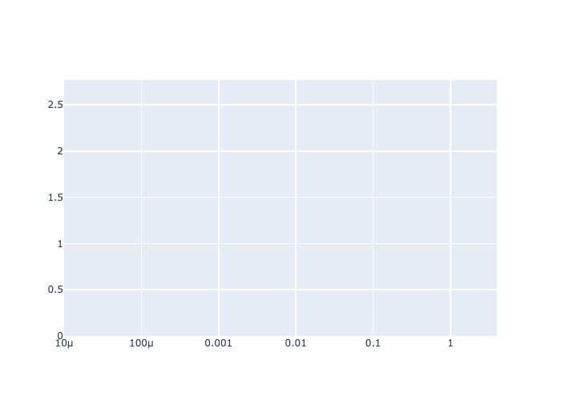

# goflow

This repository is all about simulating flow driven pruning in biological flow networks. For full package documentation see:
<https://felixk1990.github.io/go-with-the-flow/>
##  Introduction
This module 'goflow' is the final of a series of pyton packages encompassing a set of class and method implementations for a kirchhoff network datatype, in order to to calculate flow/flux on lumped parameter model circuits and their corresponding adaptation. The flow/flux objects are embedded in the kirchhoff networks, and can be altered independently from the underlying graph structure. This is meant for fast(er) and efficient computation and dependends on the packages 'kirchhoff','hailhydro'.

What does it do: Modelling morphogenesis of capillary networks which can be modelled as Kirchhoff networks, and calculate its response given flow q/ pressure dp/flux j based stimuli functions. We generally assume Hagen-Poiseulle flow and first order solution transport phenomena Given the radii r of such vessel networks we simulate its adaptation as an ODE system with <br>


The dynamic system f is usually constructed for a Lyapunov function L with <br>


such that we get <br>


The package not only includes premade Lyapunov functions and flow/flux models but further offers custom functions to be provided by the user.
##  Installation
pip install goflow
##  Usage
First you have to create your rudimentary circuit/ flow network which yu want to evolve later:
```
import numpy as np
import kirchhoff.circuit_init as kfi
from goflow.adapter import init_ivp as gi

# #initialize plexus+flow pattern
init_flow=dict(
    crystal_type='triagonal_planar',
    periods= 3,
)

C = kfi.initialize_circuit_from_crystal(**init_flow)

# plot initial network with data of choice
fig = C.plot_circuit()
fig.show()
```


Next you have to set the dynamical model (how are flows calculated, vessels adjusted during each adaptation step):
```
# set plexus parameters
pars_src = {
    'modesSRC': 'root_geometric'
}
pars_plx = {
    'modePLX':'default',
}
# set model and model parameters
pars_model = {
    'alpha_0':1.,
    'alpha_1':1.
}

# # initialize dynamic system and set integration parameters
morpheus = gi.morph_dynamic(C, 'murray', [pars_model, pars_src, pars_plx])
morpheus.evals = 200

# numerically evaluate the system
cnd = morpheus.flow.circuit.edges['conductivity']
cnd_scale = morpheus.flow.circuit.scales['conductance']

sp = {
    't0': 1e-05,
    't1': 4.,
    'x0': np.power(cnd/cnd_scale,0.25)*0.1,
}
nsol = morpheus.nlogSolve((sp['t0'],sp['t1']), sp['x0'])
# print(nsol)

dataPoints = zip(nsol.t,nsol.y.transpose())
murrayModel = morpheus.model
args = murrayModel.solver_options['args']
cost = [murrayModel.calc_cost_stimuli(t, y, *args)[0] for t, y in dataPoints]
```
When you are done, plot dynamics of vessel development:
```
# # plot dynamic data such as radii and costs
import matplotlib.pyplot as plt
fig,axs=plt.subplots(2,1,figsize=(12,6),sharex=True)
axs[0].plot(nsol.t,nsol.y.transpose(),alpha=0.1,color='b')
axs[1].plot(nsol.t,cost,alpha=0.2,color='b')

for i in range(2):
    axs[i].grid(True)
    axs[i].set_xscale('log')

axs[1].set_xlabel(r'time $t$')
axs[0].set_ylabel(r'radii $r$')
axs[1].set_ylabel(r'metabolic cost $\Gamma$')
axs[1].set_yscale('log')
plt.show()
```
<br>
If you like you may generate animations just as easily, just do the following:
```
# plot the network adaptation as a gif
kwargs = dict(
    length=10000,
#     loop=1,
)
opts = dict(
    gif_name = 'murray_triagonal_plexus.gif',
    gif_path = '../gallery'
)
gif = GIF(**opts)

# Construct list of frames
frames = []

@capture(gif)
def newfig(y):

    morpheus.flow.circuit.edges['conductivity'] = y
    lw = morpheus.flow.circuit.edges['conductivity']
    z = np.divide(lw, np.amax(lw))

    aux = {
        'color_nodes': ['#030512'],
        'color_edges': [z],
        'colormap': ['RdPu'],
    }

    figX = morpheus.flow.circuit.plot_circuit(linewidth = [10.*lw], **aux)

    return figX

for y in nsol.y.transpose()[:]:
    frame = newfig(y)
    frames.append(frame)

gif.create_gif(**kwargs) # generate gif
# plot the radii dynamics
opts['gif_name'] = 'murray_triagonal_dynm.gif'
gif = GIF(**opts)
# Construct list of frames
frames = []

y_min = np.amin(nsol.y)
y_max = np.amax(nsol.y)
x_min = np.amin(nsol.t)
x_max = np.amax(nsol.t)

@capture(gif)
def plotDynm(y,t):

    fig = go.Figure()

    for ys in Y:
        fig.add_trace(
            go.Scatter(
                x=T,
                y= ys,
                mode='lines',
                line=dict(color='rgba(0,0,255,0.1)'),
            )
        )
    fig.update_layout( dict(
#         xaxis=dict(range=[x_min, x_max], autorange=False),
#         yaxis=dict(range=[y_min, y_max], autorange=False),
        showlegend =  False,
        )
    )
    fig.update_xaxes(type="log",
                     range=[*np.log10([x_min, x_max])]
                    )# log range: 10^0=1, 10^5=100000
    fig.update_yaxes(range=[y_min, y_max]) # linear range

    return fig

for i,t in enumerate(nsol.t):

    try:
        Y = nsol.y[:,:i+1]
        T = nsol.t[:i+1]

    except:
        Y = nsol.y[:,:]
        T = nsol.t[:]

    frame = plotDynm(Y, T)
    frames.append(frame)

gif.create_gif(**kwargs) # generate gif
```
<br>
<br>

Further examples: [](https://mybinder.org/v2/gh/felixk1990/go-with-the-flow/examples)
##  Requirements
``` pandas ```,``` networkx ```, ``` numpy ```, ``` scipy ```, ``` kirchhoff ```, ``` hailhydro ```, ```plotly```
##  Gallery

## Acknowledgement
* Pre-customized models presentend and implemented here as given by:
    *  Murray, The Physiological Principle of Minimum Work, 1926
    *  Katifori et al, Damage and Fluctuations Induce Loops in Optimal Transport Networks, 2010
    *  Corson, Fluctuations and Redundancy in Optimal Transport Networks, 2010
    *  Hu and Cai, Adaptation and Optimization of Biological Transport Networks, 2013
    *  Kramer and Modes, How to pare a pair: Topology control and pruning in intertwined complex networks, 2020

```goflow``` written by Felix Kramer
